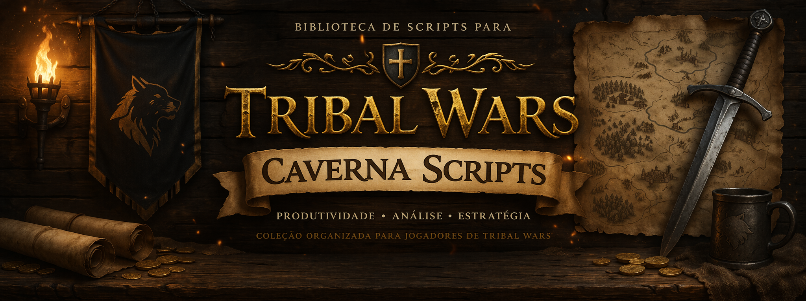

<p align="center">
  
</p>

# 🐺 CavernaScripts – Biblioteca de Scripts para Tribal Wars

Coleção organizada de scripts para melhorar a experiência no **Tribal Wars**, focada em produtividade, análise e apoio estratégico.

---

## ⚔️ Sobre o projeto

O **CavernaScripts** é um conjunto de scripts desenvolvidos para facilitar ações repetitivas, organizar informações e otimizar decisões dentro do jogo.

> ❗ Projeto focado em **qualidade de uso e praticidade**, não em automação invasiva.

---

## 🚀 Scripts em destaque

### 🧠 Hub principal

* **All in One Tampermonkey**

  * Central com vários scripts integrados
  * Interface fixa dentro do jogo
  * Atalhos rápidos e navegação facilitada

---

### ⚔️ Combate & Ataques

* Agendador de Ataques
* NT Agendado
* Derrubar Muralha

---

### 🌾 Coleta & Recursos

* Coleta em Massa
* Coleta Individual
* Nova Coleta (versão otimizada)
* Vender Recursos

---

### 📊 Análise & Inteligência

* Classificação Player K
* Filtro por Tribo
* Histórico de Players
* Identificador de Ataques
* CapNickCoord

---

### 🤝 Social & Utilidades

* Adicionar Amigos
* Sistema de Convites

---

## 📦 Packs

* **Pack Caverna**
  Conjunto de scripts prontos para uso rápido

* **All in One**
  Versão centralizada com múltiplas funcionalidades

---

## 🛠️ Como instalar

### Método 1 – Tampermonkey (Recomendado)

1. Instale a extensão:
   👉 https://www.tampermonkey.net/

2. Abra o script desejado no GitHub

3. Clique em **Raw**

4. O Tampermonkey irá detectar automaticamente

5. Clique em **Instalar**

---

## 📷 Interface (Exemplo)

> 💡 Adicione aqui prints do seu sistema depois (assets/screenshots)

---

## 📌 Organização do repositório

```
scripts/
├─ combate/
├─ coleta/
├─ analise/
├─ social/
├─ economia/
├─ packs/
└─ legacy/
```

---

## ⚠️ Avisos

* Uso por conta e risco
* Sempre revise os scripts antes de utilizar
* Evite uso excessivo ou comportamento suspeito no jogo

---

## 📜 Licença

Este projeto é distribuído gratuitamente.

❗ **Não é permitida a comercialização.**

Se alguém estiver vendendo este material:

> denuncie.

---

## 👑 Autor

Desenvolvido por **CavernaScripts**

---

## 🔥 Futuro do projeto

* Interface mais moderna no Hub
* Melhor organização dos scripts
* Atualizações contínuas
* Integração com sistemas externos (em estudo)

---

💬 Se tiver sugestões ou ideias, sinta-se à vontade para contribuir!
